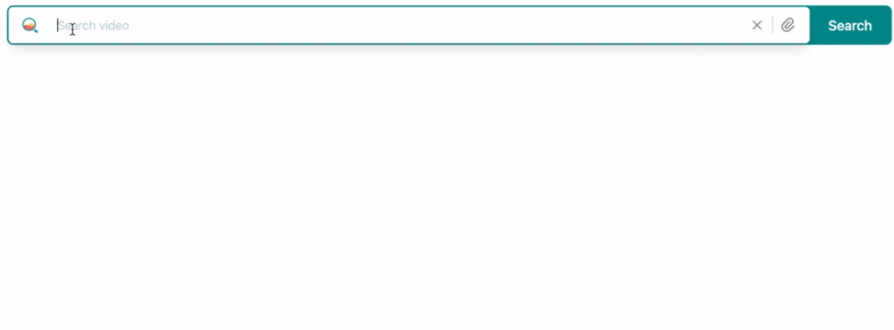
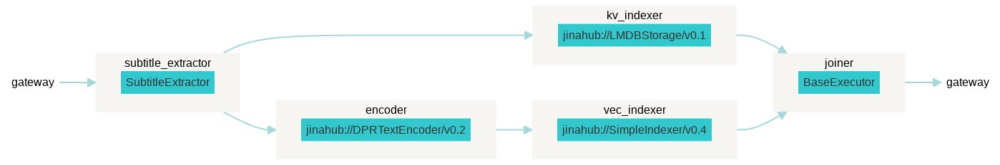
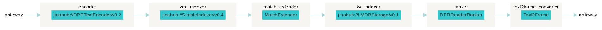

# example-video-search
This is an example of building a video Question-Answer system using Jina.

The index data is subtitle files of YouTube videos. After indexing, you can query with questions in natural langurage and retrieve the related video together with the timestamp that the corresponding answer appears. 



## Prerequisites

```bash
pip install -r requirements.txt
bash scripts/download_data.sh
```

### Usage

By default, we index the video file, `toy-data/mnnC37ewQI8.mkv`

```bash
python app.py -m index
```

Query with questions,

```bash
python app.py -m query
```

To run the video search frontend, first set it up locally.
You should have Node and Yarn installed on your machine.

```bash
cd frontend
yarn
```
This will install the necessary dependencies.

To run the search frontend, run

```bash
yarn dev
```

You can see the search frontend at [`http://localhost:3000/`](http://localhost:3000/).


## How it works

The index flow is as below. The sentences are extracted from the subtitle file. 
In the other pathway, the sentences of the subtitles are encoded by the `DPRTextEncoder`. 
The meta information of the sentences together with embeddings are stored in the `SimpleIndexer`.



The query flow is as shown below. 

1. The input query is a question which is encoded into embeddings by using `DPRTextEncoder`. 
2. The embedding of the query question is used to retrieve the sentences from `SimpleIndexer`. 
3. Rank the candidate sentences and extract the exact answers from the sentences by using `DPRReaderRanker`. 
4. Get the timestamp and video uri information about the answer candidates with `Text2Frame`



## How to index my own data? [W.I.P.]

1. download the subtitle files
```bash
youtube-dl --write-auto-sub --embed-subs https://www.youtube.com/watch\?v\=zvXkQkqd2I8 -o toy-data/zvXkQkqd2I8
```

2. run the following
```bash
python app.py -m index
python app.py -m query
```